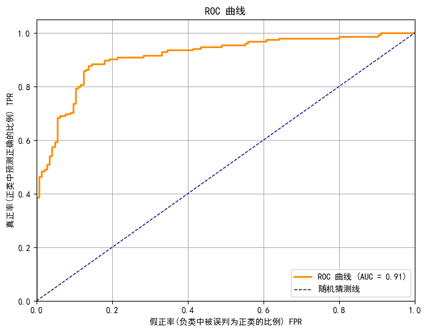
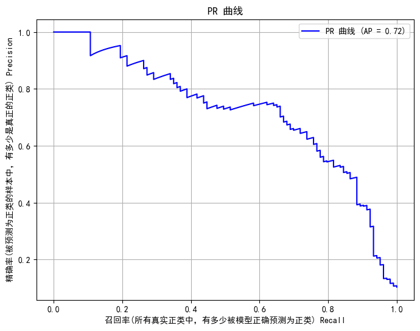

<link rel="stylesheet" href="../style.css">

# 斯皮尔曼等级相关系数(Spearman Rank Correlation Coefficient)

用来衡量两个变量之间的单调关系(monotonic relationship)的一种非参数统计方法.

简单来说, 它衡量的是：当一个变量增大时, 另一个变量是否**大致也会增大或减小**, 不要求两者线性.

---

**🧮 计算公式**

对于没有重复值的数据(无 ties)：

$$
\rho = 1 - \frac{6 \sum d_i^2}{n(n^2 - 1)}
$$

其中：

- $n$ 是样本数
- $d_i = \text{rank}(x_i) - \text{rank}(y_i)$：两个变量第 $i$ 个样本的秩差
- $\rho$ 的值范围是 $$-1, 1]

---

**📌 关键特点**

| 特点                        | 说明                                   |
| --------------------------- | -------------------------------------- |
| **非参数方法**              | 不要求变量服从正态分布, 对异常值更鲁棒 |
| **秩(rank)相关**            | 只关心数据的排序, 而非具体数值         |
| **衡量单调性**              | 能识别非线性但单调的关系               |
| **适用于分类数据/等级数据** | 也可以用于有序分类型变量               |

---

**📊 ρ 值的解释**

| ρ 值范围 | 解释                   |
| -------- | ---------------------- |
| ρ = +1   | 完全正相关, 秩完全一致 |
| ρ = -1   | 完全负相关, 秩完全相反 |
| ρ ≈ 0    | 无单调相关关系         |
| ρ > 0    | 趋势上正相关           |
| ρ < 0    | 趋势上负相关           |

---

**✅ 举个例子**

假设你有以下两个变量：

| 学生 | 数学成绩 | 物理成绩 |
| ---- | -------- | -------- |
| A    | 90       | 88       |
| B    | 80       | 82       |
| C    | 70       | 75       |
| D    | 60       | 70       |
| E    | 50       | 65       |

你可以看到数学和物理成绩是单调递减的(高数高物), 它们的 Spearman ρ ≈ 1, 表示非常强的正相关.

---

**🔬 与皮尔逊相关系数的对比**

| 对比项           | Spearman ρ         | Pearson r            |
| ---------------- | ------------------ | -------------------- |
| 类型             | 非参数             | 参数方法(需正态分布) |
| 衡量关系         | 单调关系           | 线性关系             |
| 是否受异常值影响 | 抗干扰性强(更鲁棒) | 受异常值影响大       |
| 是否基于数值大小 | 否, 只基于排名     | 是, 基于实际数值     |

---

**🧪 Python 示例(使用 `scipy`)：**

```python
from scipy.stats import spearmanr

x = [10, 20, 30, 40, 50]
y = [100, 90, 80, 70, 60]

rho, p = spearmanr(x, y)

print("Spearman ρ =", rho)
print("p-value =", p)
```

输出结果：

```
Spearman ρ = -1.0
```

说明：这两个变量是完全负相关(x 增大时 y 严格减小).

---

**✅ 应用场景**

- 排名数据的相关性分析(如学生名次 vs 成绩)
- 不满足正态分布的变量
- 数据包含异常值的情况
- 心理学、教育学、社会学等人文社科统计分析

---

**✅ 总结一句话：**

> **Spearman 相关系数是衡量两个变量是否保持一致排序的一种方法, 不要求线性, 只看“谁比谁大”. 它对非线性关系和异常值非常鲁棒. **

---

需要我帮你可视化一组数据的 Spearman vs Pearson 对比图？或者写一段 JS/Python 自动计算的代码？

# ROC 曲线

分类任务中, 通常用一个分类模型来判断样本属于正类 1 还是负类 0.

模型通常会输出一个概率值, 我们会设一个阈值 threshold, 比如 0.5 来判断最终结果是否为正类

**混淆矩阵(Confusion Matrix)**

|            | 实际为正类 | 实际为负类 |
| ---------- | ---------- | ---------- |
| 预测为正类 | TP         | FP         |
| 预测为负类 | FN         | TN         |

TP (True Positive): 预测为正类, 实际也是正类  
FP (False Positive): 预测为正类, 实际是负类  
FN (False Negative): 预测为负类, 实际是正类  
TN (True Negative): 预测为负类, 实际是负类

**主要指标**

| 指标名      | 公式           | 含义                   |
| ----------- | -------------- | ---------------------- |
| TPR(真正率) | TP / (TP + FN) | 正类中预测为正类的比例 |
| FPR(假正率) | FP / (FP + TN) | 负类中预测为正类的比例 |



- ROC 曲线展示: 阈值从 0 调到 1, FPR 为 x 轴, TPR 为 y 轴的图形
- AUC(Area Under the Curve): 0 - 1 之间的值, 越大, 模型越好

# PR 曲线

PR 曲线是以： X 轴 Recall(召回率) Y 轴 Precision(精确率)

| 指标              | 公式           | 含义                               |
| ----------------- | -------------- | ---------------------------------- |
| Precision(精确率) | TP / (TP + FP) | 预测为正的样本中, 有多少是真的正类 |
| Recall(召回率)    | TP / (TP + FN) | 所有正类中, 有多少被正确预测为正类 |

- PR 曲线展示: 阈值从 0 调到 1, Recall 为 x 轴, Precision 为 y 轴的图形
- AUC(Area Under the Curve): 0 - 1 之间的值, 越大, 模型越好


